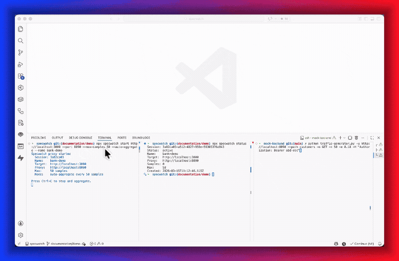
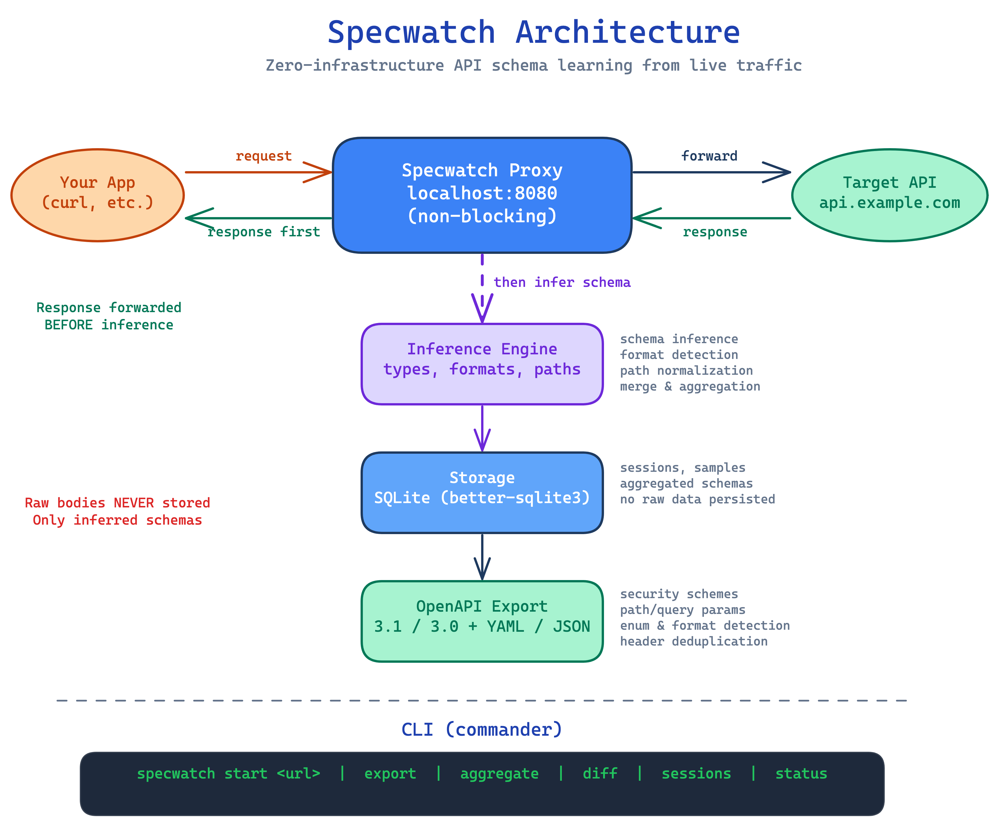

# Specwatch

[](https://github.com/rajeevramani/specwatch/actions/workflows/ci.yml)
[](https://www.npmjs.com/package/specwatch)
[](https://nodejs.org)
[](https://opensource.org/licenses/MIT)



Most APIs don't have OpenAPI specs. The ones that do are usually out of date. Writing them by hand is nobody's idea of a good time, and generating them from source code requires annotations that nobody maintains either.

Specwatch takes a different approach: point it at any API, use the API normally, and it figures out the schema from what it sees.

It runs as a local reverse proxy. No cloud, no agents, no sidecars. One CLI command, a SQLite database on your machine, and that's it.



## Quick Start

```bash
npx specwatch start https://api.example.com --name "my-api" --max-samples 200 --auto-aggregate
```

That gives you a local proxy on `localhost:8080`. Use it instead of the real API:

```bash
curl http://localhost:8080/users
curl http://localhost:8080/users/123
curl -X POST http://localhost:8080/users -d '{"name":"Alice"}'
```

With `--auto-aggregate`, specwatch aggregates every 200 samples and keeps capturing — no need to stop the server. Each aggregation creates a versioned snapshot, so you can watch the schema get more complete over time:

```bash
npx specwatch snapshots --name "my-api"
```


When you're ready, export the latest (or any specific snapshot):

```bash
npx specwatch export --name "my-api" -o openapi.yaml
npx specwatch export --name "my-api" --snapshot 2 -o openapi-v2.yaml
```

You get an OpenAPI 3.1 spec with schemas extracted into `components/schemas` using `$ref` references. The more traffic you send through it, the better the spec gets — more fields, tighter types, higher confidence.

You can also run without `--auto-aggregate` — just `Ctrl+C` when you're done and specwatch aggregates everything at once.

## What It Does

Specwatch watches HTTP traffic and infers:

- **Paths and methods** with contextual parameter naming (`/users/123` becomes `/users/{userId}`)
- **Request and response body schemas** with nested objects, arrays, and union types
- **Data types and formats** — `string`, `integer`, `number`, `boolean`, `array`, `object` with format detection (`email`, `date`, `date-time`, `uri`, `uuid`, `int32`, `int64`, `double`)
- **Required fields** — fields present in 100% of samples are marked required (except PATCH bodies, which follow partial-update semantics)
- **Enum values** — low-cardinality string fields are automatically detected as enums
- **Query parameters** with type inference
- **Path parameter types** — inferred as `integer` when all observed values are numeric
- **Security schemes** — Bearer, Basic, and API Key auth detected from headers
- **Multiple response codes** — each status code gets its own response schema
- **Breaking changes** — compare schemas across sessions to detect regressions

## Commands

### `specwatch start <url>`

Start a proxy session to learn API schemas.

```bash
specwatch start https://api.example.com \
  --port 8080 \          # Local proxy port (default: 8080)
  --name "my-api" \      # Session name (easier to remember than UUIDs)
  --max-samples 500 \    # Stop after N samples
  --auto-aggregate       # Auto-aggregate every --max-samples, keep capturing
```

With `--auto-aggregate`, the proxy aggregates a snapshot every `--max-samples` and continues capturing. Without it, press `Ctrl+C` to stop and aggregate. Press `Ctrl+C` twice to force-quit without aggregation.

### `specwatch export`

Export the generated OpenAPI spec.

```bash
specwatch export                              # Latest session, YAML to stdout
specwatch export --name "my-api"              # By session name
specwatch export --name "my-api" -o spec.yaml # Write to file
specwatch export --json                       # JSON output
specwatch export --snapshot 2                 # Export a specific snapshot
specwatch export --openapi-version 3.0        # OpenAPI 3.0.3 (default: 3.1)
specwatch export --min-confidence 0.8         # Only high-confidence endpoints
specwatch export --include-metadata           # Add x-specwatch-* extensions
specwatch export --format json                # Raw JSON (non-OpenAPI) export
```

### `specwatch status`

Show the currently active session.

### `specwatch sessions list`

List all sessions with their status, sample count, and target URL.

### `specwatch sessions delete <id>`

Delete a session and all its data.

### `specwatch aggregate [session-id]`

Re-run aggregation on a session. Useful if you want to reprocess with updated logic.

```bash
specwatch aggregate                   # Active session
specwatch aggregate --name "my-api"   # By name
```

### `specwatch snapshots [session-id]`

List snapshots for a session. Each auto-aggregate cycle creates a new snapshot, giving you a versioned history of how the schema evolves as more traffic flows through.

```bash
specwatch snapshots                   # Active session
specwatch snapshots --name "my-api"   # By name
```


Each snapshot captures the full schema at that point in time. You can export or diff any snapshot individually.

### `specwatch diff <session1> <session2>`

Compare schemas between two sessions or two snapshots within a session.

```bash
specwatch diff abc123 def456
specwatch diff --name1 "v1" --name2 "v2"
specwatch diff --name "my-api" --snapshots 1 3   # Compare snapshots within a session
```

## How It Works

Specwatch has five layers:

1. **Proxy** — Transparent HTTP reverse proxy (http-proxy). Forwards the response to you first, then runs inference in the background. Your requests are never slowed down.

2. **Inference** — Analyzes JSON request/response bodies to infer schema types, formats, and structure. Handles nested objects, arrays, and union types.

3. **Storage** — Stores inferred schemas in SQLite (better-sqlite3). Raw request/response data is never persisted — only the inferred schemas.

4. **Aggregation** — Merges schemas from multiple samples into a consensus schema per endpoint. Calculates required fields, confidence scores, and detects breaking changes.

5. **Export** — Generates OpenAPI 3.1 (or 3.0) specs with proper path parameters, query parameters, security schemes, and response codes.

## Key Design Decisions

- **Privacy first** — Raw request/response bodies are never stored. Only inferred schemas are persisted.
- **Non-blocking proxy** — Response is forwarded to the client before inference runs. Zero latency impact.
- **Foreground only** — No daemon or PID file. The proxy runs in the foreground and stops cleanly with `Ctrl+C`.
- **Body limit** — Bodies over 1MB are skipped entirely (not truncated) to avoid memory issues.
- **Confidence scoring** — Each endpoint gets a confidence score based on sample count, field consistency, and type stability.
- **PATCH semantics** — Fields in PATCH request bodies are never marked as required, following partial-update conventions.

## Caveats

- **Schemas reflect observed traffic, not the full API contract.** If a field is never seen in the captured samples, it won't appear in the spec. More diverse traffic produces better specs.
- **Monetary/numeric fields may be typed as `integer` instead of `number`** when the server only returns whole numbers in the observed samples. Specwatch infers the narrowest type that fits all observed values.
- **Enum detection requires sufficient samples.** Fields are only marked as enums when there are enough samples to be confident the observed values represent the full set (>=10 samples, <=10 distinct values).
- **Database migrations are automatic.** When you upgrade specwatch, your existing database is migrated automatically. No manual action needed.

## Requirements

- Node.js >= 20

## Development

```bash
npm install       # Install dependencies
npm run build     # Build with tsup
npm run test      # Run tests (806 tests, vitest)
npm run lint      # Lint with eslint
npm run format    # Format with prettier
```

## License

MIT
