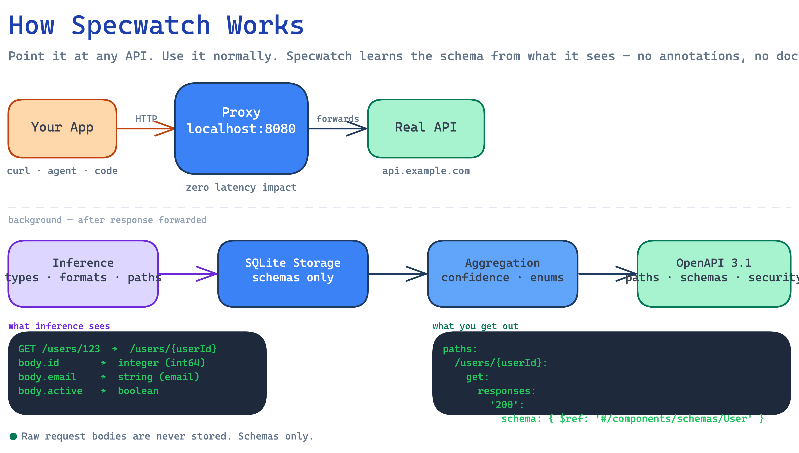
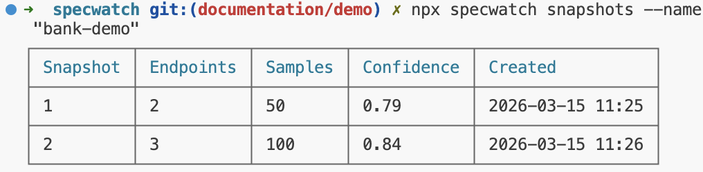
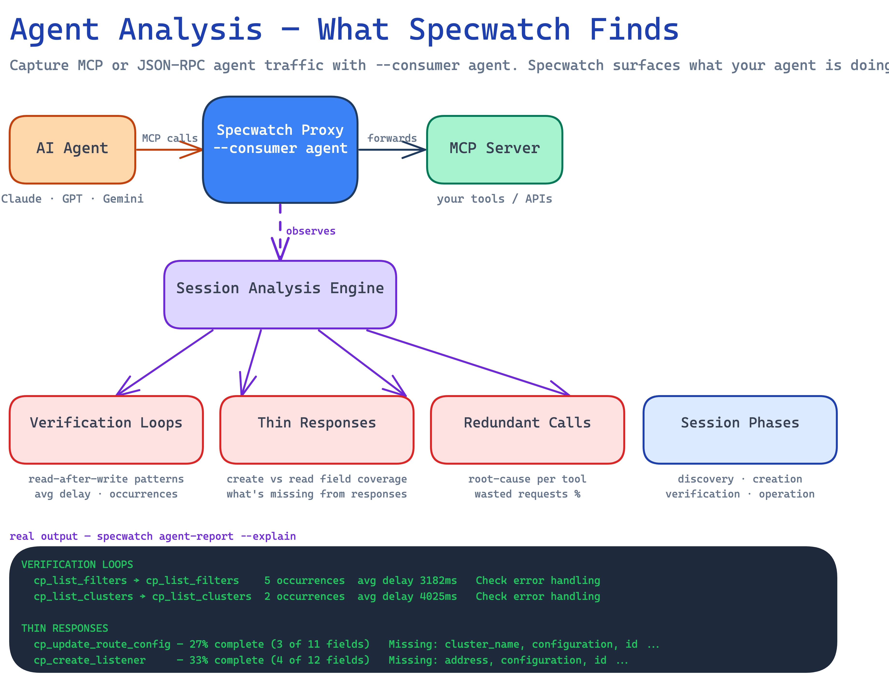

# Specwatch

[](https://github.com/rajeevramani/specwatch/actions/workflows/ci.yml)
[](https://www.npmjs.com/package/specwatch)
[](https://nodejs.org)
[](https://opensource.org/licenses/MIT)
[](https://deepwiki.com/rajeevramani/specwatch)

**Specwatch does two things:**

1. **Learns API schemas from traffic** — point it at any HTTP API, use it normally, get an OpenAPI spec out. No annotations, no source code access required.
2. **Analyses agent behaviour** — watch MCP or JSON-RPC agent sessions and surface exactly where agents are wasting calls, why, and what to fix.

It runs as a local reverse proxy. No cloud. No agents. One CLI command and a SQLite database on your machine.

---

## API Schema Learning



Most APIs don't have OpenAPI specs. The ones that do are usually out of date. Specwatch takes a different approach: point it at any API, use it normally, and it learns the schema from what it observes.

```bash
npx specwatch start https://api.example.com --name "my-api" --max-samples 200 --auto-aggregate
```

That gives you a local proxy on `localhost:8080`. Use it instead of the real API:

```bash
curl http://localhost:8080/users
curl http://localhost:8080/users/123
curl -X POST http://localhost:8080/users -d '{"name":"Alice"}'
```

With `--auto-aggregate`, specwatch aggregates every 200 samples and keeps capturing — no need to stop the server. Each aggregation creates a versioned snapshot, so you can watch the schema get more complete over time:

```bash
npx specwatch snapshots --name "my-api"
```



When you're ready, export:

```bash
npx specwatch export --name "my-api" -o openapi.yaml
```

You get an OpenAPI 3.1 spec with schemas extracted into `components/schemas` using `$ref` references. The more traffic you send through, the better the spec gets.

**What it infers from traffic:**
- Paths and methods — `/users/123` becomes `/users/{userId}`
- Request and response body schemas with nested objects, arrays, union types
- Data types and formats — `string`, `integer`, `number`, `boolean`, `array`, `object` with format detection (`email`, `date`, `date-time`, `uri`, `uuid`)
- Required fields — fields present in 100% of samples
- Enum values — low-cardinality string fields detected automatically
- Query parameters with type inference
- Security schemes — Bearer, Basic, API Key detected from headers
- Multiple response codes — each status code gets its own schema
- Breaking changes — compare schemas across sessions

---

## Agent Analysis



If you're building MCP servers or running AI agents against APIs, specwatch can tell you what your agent is actually doing — and what it's doing inefficiently.

Start with `--consumer agent`:

```bash
npx specwatch start https://your-mcp-server.com --consumer agent --name "my-agent" --auto-aggregate
```

Then generate an agent-friendliness report:

```bash
npx specwatch agent-report --name "my-agent"
```

Here's what a real report looks like — 79 MCP tool calls captured from an Envoy control plane agent:

```
Agent-Friendliness Report: option-matrix-4 (79 samples, 24 tools)

TOOL USAGE
┌────────────────────────────┬───────┬────────┐
│ Tool                       │ Calls │ Status │
├────────────────────────────┼───────┼────────┤
│ cp_list_filters            │ 9     │        │
│ cp_list_clusters           │ 8     │        │
│ initialize                 │ 3     │        │
│ tools/list                 │ 3     │        │
└────────────────────────────┴───────┴────────┘

VERIFICATION LOOPS
┌───────────────────────────────────────┬─────────────┬───────────┬──────────────────────┐
│ Pattern                               │ Occurrences │ Avg Delay │ Recommendation       │
├───────────────────────────────────────┼─────────────┼───────────┼──────────────────────┤
│ cp_list_filters → cp_list_filters     │ 5           │ 3182ms    │ Check error handling │
│ cp_list_clusters → cp_list_clusters   │ 2           │ 4025ms    │ Check error handling │
└───────────────────────────────────────┴─────────────┴───────────┴──────────────────────┘

THIN RESPONSES
  cp_update_route_config — 27% complete (3 of 11 fields)
    Missing: cluster_name, configuration, created_at, id ...
  cp_create_listener — 33% complete (4 of 12 fields)
    Missing: address, configuration, created_at, id ...

SUMMARY
  Wasted requests: 9 of 79 (11%)
  Avg response completeness: 0.47
```

**What the analysis surfaces:**
- **Verification loops** — agents re-fetching what they just created, because the create response didn't return enough state
- **Thin responses** — which tools return incomplete objects (the root cause of most verification loops)
- **Redundant calls** — root-cause analysis of unnecessary repeated calls
- **Session phases** — how the agent structured its work across discovery, creation, verification, and operation

This report tells you something important: the 11% wasted requests aren't the agent's fault. `cp_update_route_config` only returns 27% of its fields. The agent re-fetches because it can't trust the response. Fix the tool response, fix the agent behaviour.

### LLM-Powered Explanations

Add `--explain` for natural language analysis of each finding:

```bash
npx specwatch agent-report --name "my-agent" --explain
npx specwatch investigate --name "my-agent" --explain
```

Works with local Ollama models or any OpenAI-compatible API. Configure via `.env` or environment variables:

```bash
LLM_BASE_URL=http://localhost:11434/v1   # Ollama (recommended: qwen2.5:1.5b)
LLM_API_KEY=your-key
LLM_MODEL=qwen2.5:1.5b
```

> **Model recommendation:** `qwen2.5:1.5b` (986 MB) scores 96% on the specwatch explanation task zero-shot. No fine-tuning required.

---

## Quick Start

```bash
# Learn an API schema
npx specwatch start https://api.example.com --name "my-api" --auto-aggregate

# Analyse agent traffic
npx specwatch start https://your-mcp-server.com --consumer agent --name "my-agent" --auto-aggregate

# Export OpenAPI spec
npx specwatch export --name "my-api" -o openapi.yaml

# Generate agent report
npx specwatch agent-report --name "my-agent" --explain
```

---

## Commands

### `specwatch start <url>`

Start a proxy session.

```bash
specwatch start https://api.example.com \
  --port 8080 \          # Local proxy port (default: 8080)
  --name "my-api" \      # Session name
  --max-samples 500 \    # Stop after N samples
  --auto-aggregate \     # Auto-aggregate every --max-samples, keep capturing
  --consumer agent       # Enable agent analysis (MCP/JSON-RPC)
```

### `specwatch export`

Export the generated OpenAPI spec.

```bash
specwatch export --name "my-api" -o spec.yaml
specwatch export --json                       # JSON output
specwatch export --snapshot 2                 # Specific snapshot
specwatch export --openapi-version 3.0        # OpenAPI 3.0.3 (default: 3.1)
specwatch export --min-confidence 0.8         # High-confidence endpoints only
specwatch export --include-metadata           # Add x-specwatch-* extensions
```

### `specwatch agent-report`

Generate an agent-friendliness report.

```bash
specwatch agent-report --name "my-agent"
specwatch agent-report --name "my-agent" --explain   # LLM-powered explanations
```

### `specwatch investigate`

Deep-dive into redundant calls for a specific operation.

```bash
specwatch investigate --name "my-agent"
specwatch investigate --name "my-agent" --tool "cp_list_clusters"
specwatch investigate --name "my-agent" --explain
```

### `specwatch diff`

Compare schemas between sessions or snapshots.

```bash
specwatch diff --name1 "v1" --name2 "v2"
specwatch diff --name "my-api" --snapshots 1 3
```

### Other Commands

```bash
specwatch status                        # Active session
specwatch stop                          # Stop session and aggregate
specwatch sessions list                 # All sessions
specwatch sessions delete <id>          # Delete session
specwatch aggregate --name "my-api"     # Re-run aggregation
specwatch snapshots --name "my-api"     # List snapshots
```

---

## How It Works

Five layers, each isolated:

1. **Proxy** — Transparent HTTP reverse proxy. Forwards the response to you first, then runs inference in the background. Zero latency impact.
2. **Inference** — Analyses JSON request/response bodies to infer schema types, formats, and structure. Handles nested objects, arrays, union types.
3. **Storage** — SQLite (better-sqlite3). Raw request/response data is never persisted — only inferred schemas.
4. **Aggregation** — Merges schemas from multiple samples into a consensus schema per endpoint. Calculates required fields, confidence scores, detects breaking changes.
5. **Export** — Generates OpenAPI 3.1 (or 3.0) specs with path parameters, query parameters, security schemes, and response codes.

**Key design decisions:**
- Raw request/response bodies are never stored — only inferred schemas
- Non-blocking proxy — response forwarded before inference runs
- Foreground only — no daemon, no PID file, stops cleanly with `Ctrl+C`
- Bodies over 1MB are skipped entirely (not truncated)
- PATCH bodies: fields never marked as required (partial-update semantics)

---

## Caveats

- **Schemas reflect observed traffic, not the full API contract.** Fields never seen won't appear in the spec.
- **Numeric fields typed as `integer` when only whole numbers observed.** Specwatch infers the narrowest type that fits.
- **Enum detection requires sufficient samples.** ≥10 samples, ≤10 distinct values.
- **Database migrations are automatic** when upgrading.

---

## Requirements

Node.js >= 20

## Development

```bash
npm install       # Install dependencies
npm run build     # Build with tsup
npm run test      # Run tests (1037 tests, vitest)
npm run lint      # Lint with eslint
npm run format    # Format with prettier
```

## License

MIT
